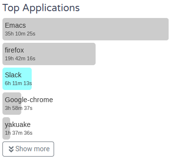

+++
title = "Emacs Carnival 2025-07: Writing Experience"
date = 2025-07-26
tags = ["emacs", "org-mode"]
draft = false
author = "Nick Anderson"
+++

This is my contribution to the [Emacs Carnival 2025-07: Writing Experience](https://gregnewman.io/blog/emacs-carnival-2025-07-writing-experience/).

For me the experience of writing in Emacs is a frequent, ever evolving, largely in org-mode, magical experience that has became critical for the way I operate.



I use [org-roam](https://www.orgroam.com/) for capturing. I really like the ability to specify the template for a new file separately from the template to append to an existing file. This really helped me switch from a methodology centered around fewer larger files, to one centered around more smaller files.

I make heavy use of "dailies" with over 100 templates the last time I looked (<https://fosstodon.org/@nickanderson/114372351550538547>). Now, the way I manage those templates heh, well it mostly works for me, but it's sort of a hot mess. I have a massive org-mode file for my org-roam configuration. There are many elisp src blocks. One src block is full of noweb references for all the blocks I want to use. And I load my org-roam config manually, by executing 4 different call lines.

My _work log_ is my primary workspace. I try to capture for each thing I do during the day. Captures to my work log automatically clock time and the new file each day is seeded with bits of information to help guide me. I use [activity-watch-mode](https://activitywatch.net/) to help me keep track of more detailed info like active buffers and modes.

For example, the top of my work log contains a couple of org-babel call statements and an org-ql dynamic block that will surface unfinished things from the prior three months worth of work log files. I like how I can see the state of my todos yesterday by looking at yesterdays work log file. It helps to provide perspective when reflecting on workloads at various times. And, it creates a natural aging out of a task if I don't get to it and don't explicitly bring it forward.

So, with a query result full of todos I start capturing notes for everything I do. When it's time for a meeting I will capture with that meeting template. I track some metrics for some meetings and those meeting templates contain links to where those metrics are stored. I will navigate there, execute a babel call and then go back to the meeting note and bring the content from the metrics file into the meeting note via [org-transclusion](https://github.com/nobiot/org-transclusion).

I make frequent typos, but `flyspell` let's me know right away if it hasn't already been magically fixed by `abbrev-mode`. It really is one of those things that makes it feel magical. I type `teh` and the moment I hit space it's magically fixed to `the`. In fact, looking at my config I seem to use abbreviations exclusively for fixing typos.

I use [writegood-mode](https://github.com/bnbeckwith/writegood-mode) and have played with [harper-ls](https://github.com/Automattic/harper/blob/master/harper-ls/README.md) but I found it a bit slow to leave on so time will tell if it's useful enough to remember manually activating it.

Some things are secret, and thanks to [org-crypt](https://orgmode.org/manual/Org-Crypt.html) I can tag them with `:crypt:` and they are automatically encrypted for my eyes only with gpg. I use this for some example snippets that contain secrets and also for private notes in my journal and notes about people.

Visually, [org-modern](https://github.com/minad/org-modern), [org-modern-indent](https://github.com/jdtsmith/org-modern-indent), [org-appear](https://github.com/awth13/org-appear), [valign](https://github.com/casouri/valign), [olivetti-mode](https://github.com/rnkn/olivetti), [org-bullets](https://github.com/sabof/org-bullets) help to make things look nice. But I struggle with tables not aligning perfectly all the time. Mostly I have learned to tolerate or ignore it.

I make heavy use of org-babel. Often, org-mode is my shell. It provides a human readable and annotated log of my work as I do it.

I use org-rich-yank frequently to take notes on code or any other text that I am reading in emacs.

Org-mode is my native syntax. I write text once, in org-mode, and quickly re-use it for sending formatted emails, exporting to formatted jira wiki syntax for beautiful comments and descriptions in jira tickets, or to various flavors of markdown, html, pdf and probably anything else my heart desired.

I check email in Emacs using [mu4e](https://djcbsoftware.nl/code/mu/mu4e/index.html), and so naturally, to write a response I simply capture the email to org-mode and write there. When I am ready to send it I run [org-mime](https://github.com/org-mime/org-mime/) to make the subtree or buffer into a properly formatted multipart ascii text / html email.

While writing I might select some text, call upon [gptel](https://github.com/karthink/gptel) to dispatch something to an llm. I have begun exposing tools in Emacs to llms. [Jira-cli-mcp](https://github.com/choplin/jira-cli-mcp) tool allows read and write access to tickets via [jira-cli](https://github.com/ankitpokhrel/jira-cli). Most recently, inspired by [llm-tool-collection](https://github.com/skissue/llm-tool-collection) and [gptel-got](https://git.bajsicki.com/phil/gptel-got) I have created bespoke tools with [Aider](https://aider.chat/) via [aidermacs](https://github.com/MatthewZMD/aidermacs) and [aider.el](https://github.com/tninja/aider.el) and gptel inside Emacs and [gemini-cli](https://github.com/google-gemini/gemini-cli), openai web chat, and gemini web chat outside of Emacs to operate on my org-roam corpus. I now have tools to return todays daily note content, add a new entry to my daily notes, surface recently modified notes, notes with the most references and pull various statistics from my org-roam database. At some point my periodic org-mode stat dump (<https://fosstodon.org/tags/OrgRoamUi>) might be completely llm driven.

For example, the prompt:

```text { linenos=false }
Use each of the org-roam db statistics that you have access to.
Generate a summary of the results. Do it in the style of a news report.
```

The tool calls:

```text { linenos=false }
#+begin_tool (db_stats :action "count-files")
(:name "db_stats" :args (:action "count-files"))

There are 5453 files in the org-roam database.
#+end_tool
#+begin_tool (db_stats :action "count-nodes")
(:name "db_stats" :args (:action "count-nodes"))

There are 16723 nodes in the org-roam database.
#+end_tool
#+begin_tool (db_stats :action "count-tags")
(:name "db_stats" :args (:action "count-tags"))

There are 246 unique tags in the org-roam database.
#+end_tool
#+begin_tool (db_stats :action "avg-tags-per-file")
(:name "db_stats" :args (:action "avg-tags-per-file"))

The average number of tags per file is 2.52.
#+end_tool
#+begin_tool (db_stats :action "median-tags-per-file")
(:name "db_stats" :args (:action "median-tags-per-file"))

The median number of tags per file is 0.00.
#+end_tool
#+begin_tool (db_stats :action "info")
(:name "db_stats" :args (:action "info"))

Available actions: 'count-files', 'count-nodes', 'count-tags', 'avg-tags-per-file', 'median-tags-per-file',
'max-tags-per-file', 'min-tags-per-file', 'info'.
#+end_tool
#+begin_tool (db_stats :action "max-tags-per-file")
(:name "db_stats" :args (:action "max-tags-per-file"))

The maximum number of tags per file is 122.
#+end_tool
#+begin_tool (db_stats :action "min-tags-per-file")
(:name "db_stats" :args (:action "min-tags-per-file"))

The minimum number of tags per file is 0.
#+end_tool
```

And the response:

> Breaking News from the world of personal knowledge management! An audit of the org-roam database has just concluded, revealing fascinating insights into the structure and organization of information.
>
> In a stunning development, a total of 5,453 files have been cataloged within the system. These files have given rise to a massive 16,723 nodes, indicating a highly interconnected web of knowledge. The tagging system, a crucial component of org-roam's functionality, shows 246 unique tags in use.
>
> On average, each file is associated with approximately 2.52 tags, suggesting a robust categorization strategy. However, the median number of tags per file stands at 0.00, which may indicate a segment of the database that is less comprehensively tagged. On the higher end, one file boasts an extraordinary 122 tags, while the minimum remains at zero, reinforcing the observation of varied tagging practices across the dataset.
>
> This report comes as the org-roam system continues to evolve, with users actively engaging its diverse features, including file, node, and tag management, as well as in-depth statistical analysis. Further details on the system's capabilities can be found using the 'info' action.

On mobile, as an Android user [Orgzly](https://orgzly.com/), or [Orgzly-revived](https://github.com/orgzly-revived/orgzly-android-revived) is the obvious answer. It works well for me for quick capture and easy review of a subset of notes via the saved searches and desktop widget. I find it kind of terrible for editing of a long note or interacting with any large note.

I do serious work on mobile at times, usually when traveling. I enjoy bringing a [keyboard](https://www.lofree.co/products/lofree-flow-the-smoothest-mechanical-keyboard) for use on mobile. I often attach my phone to the headrest in front of me and use my tray table for my keyboard. It's significantly more spacious than my laptop and I get the full Emacs and org-mode experience via [Termux](https://termux.dev/en/).

[Orgro](https://orgro.org/) is good as well, though I don't find myself using it actively. I do wish for other more beautiful and feature rich org-mode apps, at times I admit I am envious at some of the selection on iOS.

I have had great success for years using [Syncthing](https://syncthing.net/downloads/) and [Syncthing-Fork](https://github.com/Catfriend1/syncthing-android) to synchronize subsets of my org-mode notes between multiple devices, including mobile. However, I think I have achieved that success by tempering my expectations and intentionally choosing workflows that minimize potential for synchronization conflicts, to the point of each device having a unique capture template when multiple devices are capturing to the same Syncthing folder.

It's been decade (well on towards two) since I had have considered using a different tool beyond a peek around. In that time my workflows have changed dramatically, but usually change happens in very small bursts. It takes time to form new habits and see what feels good. I am beginning to approach the sort of longevity, reliability, robustness, and flexibility that I was aiming for.
